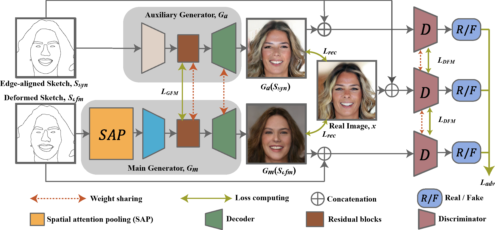
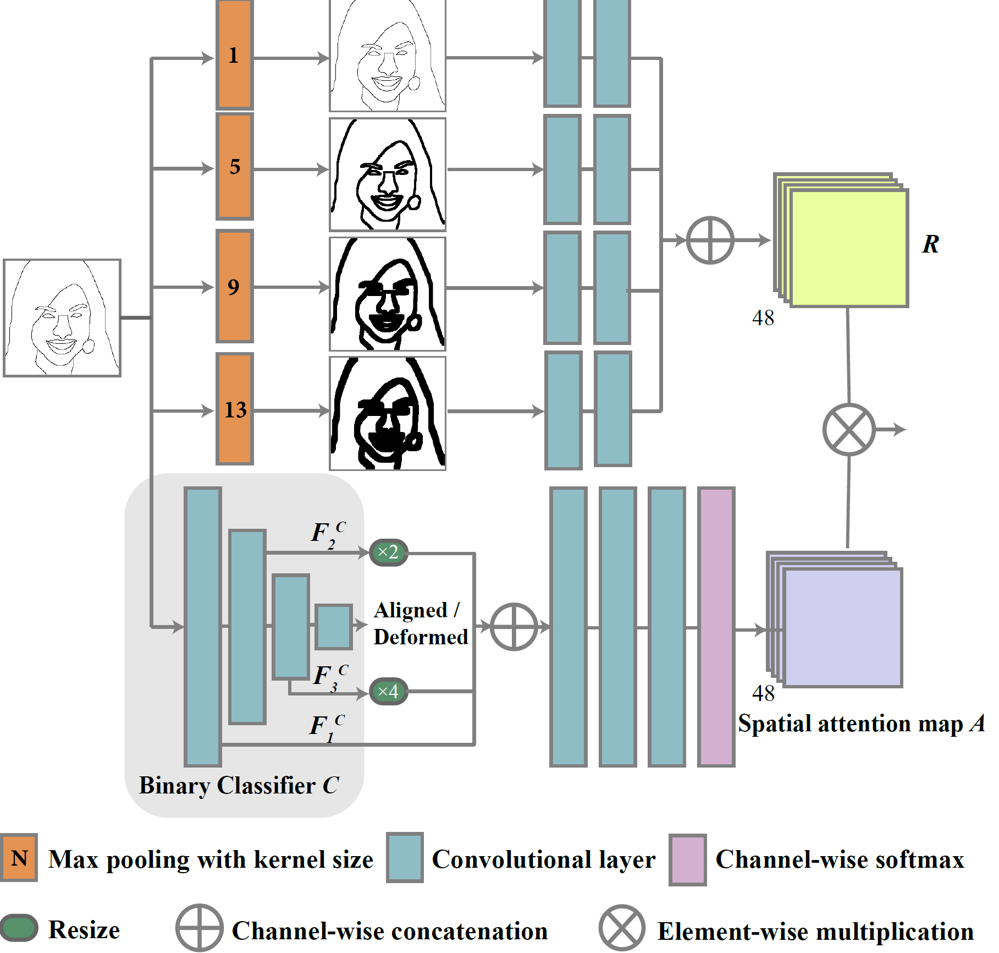
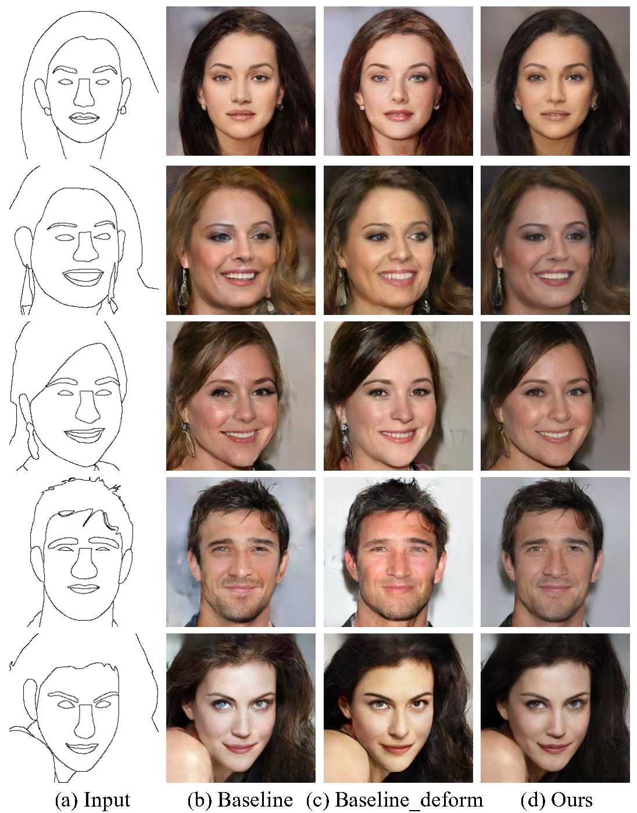
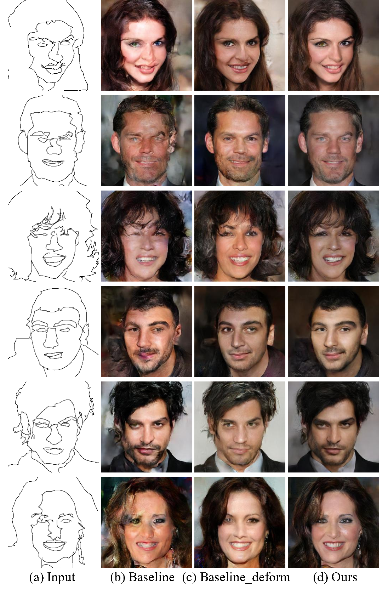
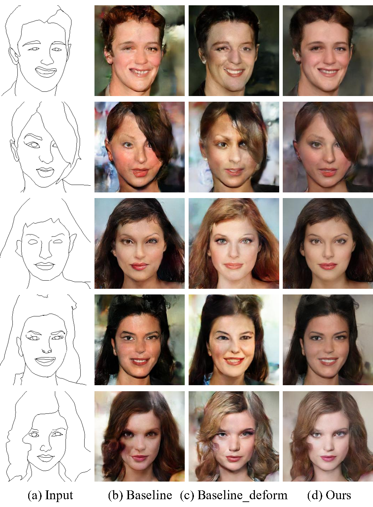
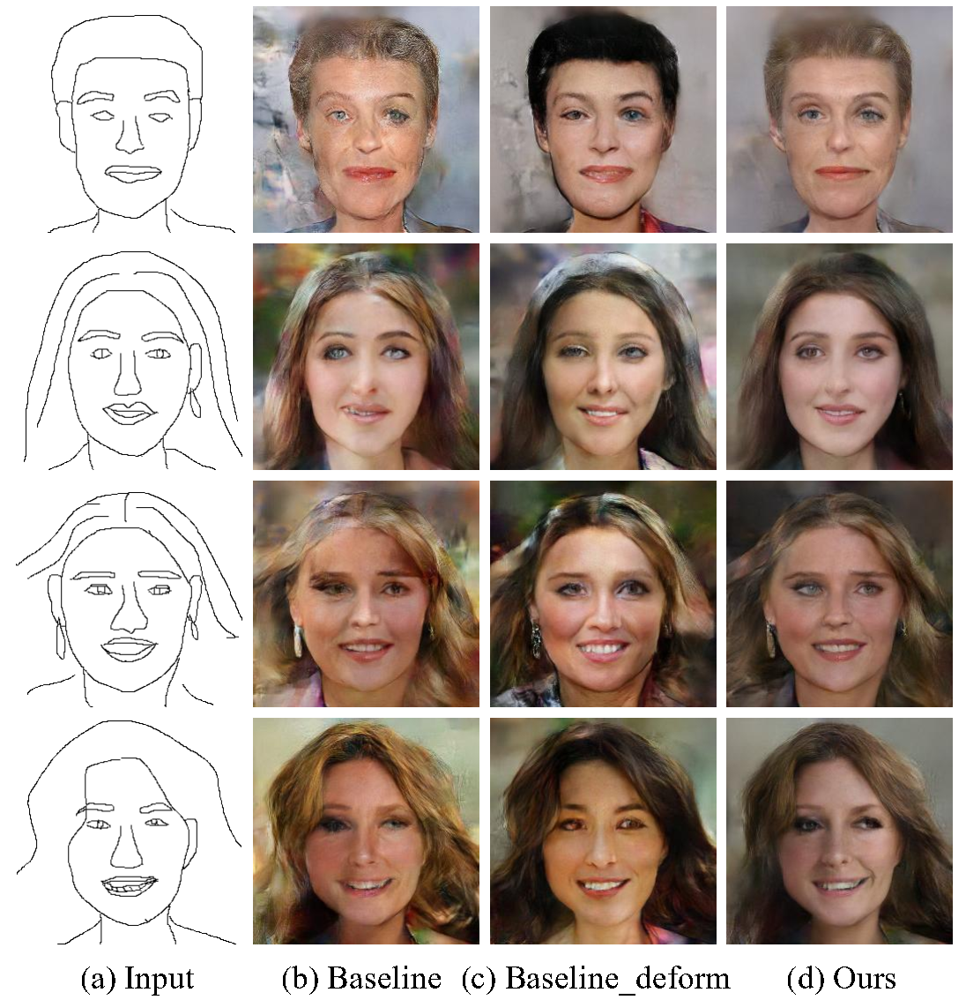

# DeepFacePencil: Creating Face Images from Freehand Sketches
<center>Yuhang Li, <a href="http://staff.ustc.edu.cn/~xjchen99" target="_new">Xuejin Chen*</a>, Binxin Yang, Zihan Chen, Zhiyuan Cheng, and Zheng-Jun Zha</center>

<center>National Engineering Laboratory for Brain-inspired Intelligence Technology and Application</center>

<center>University of Science and Technology of China</center>

## Abstact
In this paper, we explore the task of generating photo-realistic
face images from hand-drawn sketches. Existing image-to-image
translation methods require a large-scale dataset of paired sketches
and images for supervision. They typically utilize synthesized edge
maps of face images as training data. However, these synthesized
edge maps strictly align with the edges of the corresponding face
images, which limit their generalization ability to real hand-drawn
sketches with vast stroke diversity. To address this problem, we
propose DeepFacePencil, an effective tool that is able to generate
photo-realistic face images from hand-drawn sketches, based on
a novel dual generator image translation network during training.
A novel spatial attention pooling (SAP) is designed to adaptively
handle stroke distortions which are spatially varying to support
various stroke styles and different level of details. We conduct
extensive experiments and the results demonstrate the superiority
of our model over existing methods on both image quality and
model generalization to hand-drawn sketches.

## Architecture
<p align="center">
 
</p>
 
**Figure 1**: The architecture of our dual-generator model with spatial attention pooling (SAP) for deformed sketches. In order
to train a face image generator 𝐺𝑚 for hand-drawn sketches, we synthesize deformed sketches S𝑑𝑓𝑚 from an edge-aligned
sketch S𝑠𝑦𝑛 and design a spatially attention pooling module to extract shape and structure features from distorted sketches.
The dual generators 𝐺𝑚 and 𝐺𝑎 are trained simultaneously with three discriminators in an adversarial manner.

## Spatial Attention Pooling (SAP)
<p align="center">
 
</p>

**Figure 2**: Network architecture of our spatial attention pooling
module.

## Results

<p align="center">
 
</p>

**Figure 3**: Both our model and existing models, which generate
plausible photo-realistic face images from synthesized
sketches in training set, are able to be generalized to synthesized
test sketches without deformation that shows similar
distribution with the training data distribution.

<p align="center">
 
</p>

**Figure 4**: For sketches with large deformation, both baseline model and baseline_deform model fail to generate satisfying results. Artifacts can be found in areas with large sketch deformation in (b) and (c). Our results maintain high image quality even large deformation occurs in the input sketch.

<p align="center">
 
</p>

**Figure 5**: Our model is successfully generalized to well-drawn expert sketches, while the result quality of baseline models degenerates even trained with deformed sketches.

<p align="center">
 
</p>

**Figure 6**: For these challenging sketches drawn by common users, our model is able to generate plausible results. In comparison, the results of baseline models are over blurry and present obvious artifacts in fine textures.
 
# Acknowledgement
This work was supported by the National Key Research & Development
Plan of China under Grant 2016YFB1001402, the National
Natural Science Foundation of China (NSFC) under Grants 61632006,
U19B2038, and 61620106009, as well as the Fundamental Research
Funds for the Central Universities under Grants WK3490000003
and WK2100100030.We thank the Supercomputing Center of USTC
for providing computational resources.

# BibTex
```
@inproceedings{DeepFacePencil,
 author = {Li, Yuhang and Chen, Xuejin and Yang, Binxin and Chen, Zihan and Cheng, Zhihua and Zha, Zheng-Jun},
 title = {DeepFacePencil: Creating Face Images from Freehand Sketches},
 booktitle = {Proceedings of the 28th ACM International Conference on Multimedia},
 series = {MM '20},
 year = {2020},
 isbn = {978-1-4503-7988-5/20/10},
 location = {Seattle, WA, USA},
 pages = {},
 numpages = {9},
 url = {http://doi.acm.org/10.1145/3394171.3413684},
 doi = {10.1145/3394171.3413684},
 acmid = {3413684},
 publisher = {ACM},
 address = {New York, NY, USA},
 keywords = {Sketch-based synthesis, face image generation, spatial attention, dual generator, conditional generative adversarial networks},
} 
```

## Links

[Demo](http://202.38.69.241:42333/)

[Paper](https://arxiv.org/abs/2008.13343)

[Code](https://github.com/LiYuhangUSTC/Sketch2Face)

[Lines2Face Project](https://liyuhangustc.github.io/Lines2Face/)
